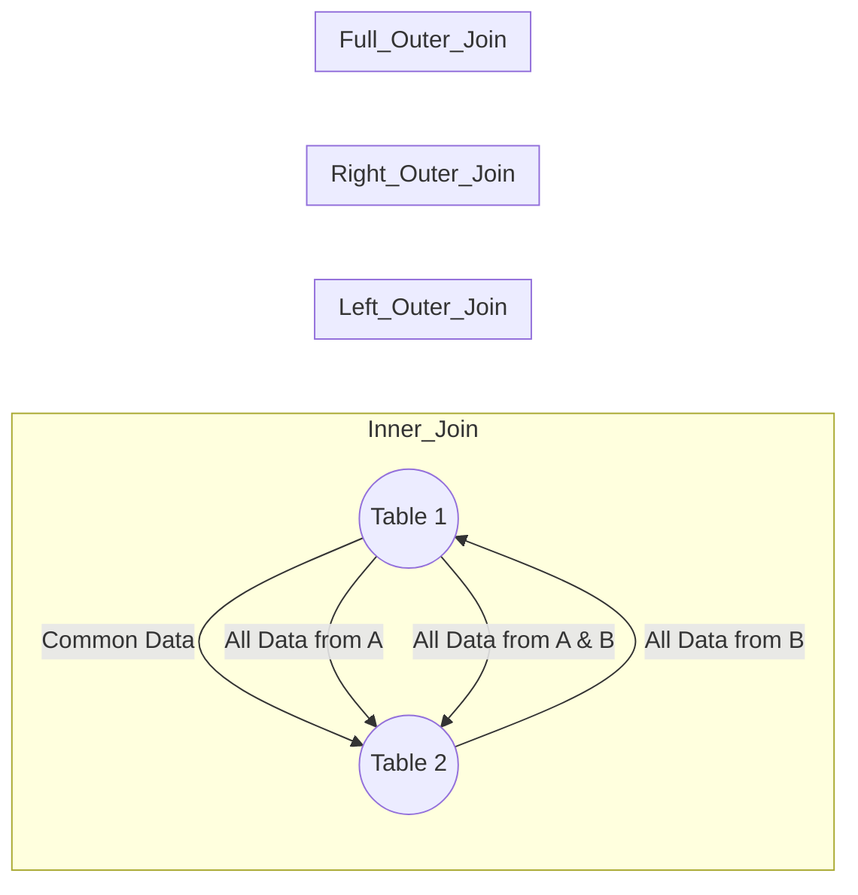

# Join in MySQL

You can create simple Venn diagrams using text and Markdown syntax to represent internal (inner) and external (outer) joins in MySQL. Below is an example of how you might represent these concepts using Markdown:

#### Inner Join

```markdown
#### Inner Join
```

```
  +--------+  
 /   A    /|  
+--------+ |  
|   B    |/  
+--------+
```

* **A**: Table 1
* **B**: Table 2
* **Intersection**: Common data in both Table 1 and Table 2.

#### Left Outer Join

```markdown
#### Left Outer Join
```

```
+----------+  
|  +---+   |  
|  | B |   |  
|  +---+   |  
|    A     |  
+----------+
```

* **A**: Table 1
* **B**: Common data in Table 1 and Table 2.

#### Right Outer Join

```markdown
#### Right Outer Join
```

```
   +----------+
   |     B    |
   |   +---+  |
   |   | A |  |
   |   +---+  |
   +----------+
```

* **A**: Common data in Table 1 and Table 2.
* **B**: Table 2.

#### Full Outer Join

```markdown
#### Full Outer Join
```

```
+--------------+
|     A        |
|  +--------+  |
|  |        |  |
|  |   B    |  |
|  +--------+  |
|              |
+--------------+
```

* **A**: Table 1
* **B**: Table 2
* **Union**: All data from both tables.

These diagrams are simple ASCII representations. If you need more complex diagrams with circles and better visualization, you can use tools like Mermaid.js, which can be integrated into GitBook for more advanced diagrams:

#### Example using Mermaid.js

````markdown


This code would render diagrams in GitBook with circles and labels to represent different types of joins.
```
