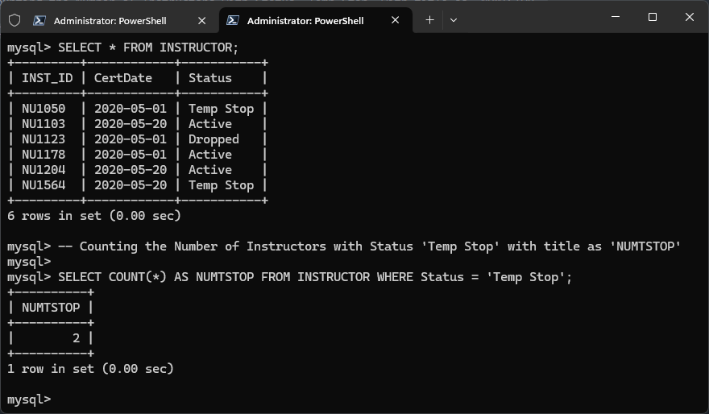
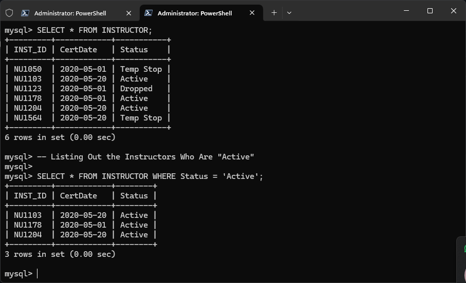
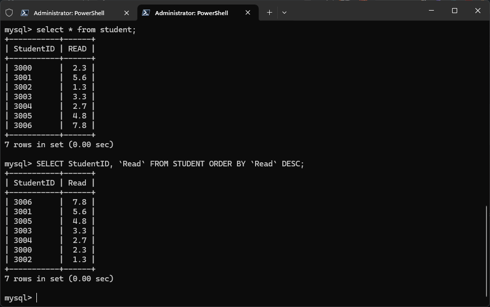
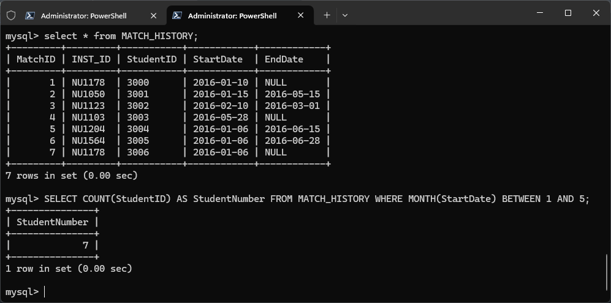

# Question Paper - 1

## Question 1

### **1.A)** Discuss any THREE (3) current issues on security in managing databases. (6 MARKS)

1. **Data Breaches:** Unauthorized access to sensitive data, leading to information theft or leaks.
2. **SQL Injection:** Attackers manipulate SQL queries to gain unauthorized access or make unauthorized changes to the database.
3. **Insider Threats:** Employees or users with legitimate access to the database may misuse their privileges, either intentionally or accidentally, causing harm.
4. **Weak Access Controls:** Poor management of user permissions can lead to unauthorized users accessing or modifying sensitive data.
5. **Ransomware Attacks:** Malicious software that locks the database, with attackers demand for a ransom to unlock or restore access to the data.

### **1.B)** Explain THREE (3) advantages of a Database Management System (DBMS). (6 MARKS)

1. **Data Consistency:** Ensures that data remains consistent across different applications, reducing errors or unusual problems.
2. **Data Security:** Implements security measures like encryption and access controls to protect data from unauthorized access.
3. **Data Sharing:** Allows multiple users to access the database at the same time without causing conflicts, making it easier to work together.
4. **Efficient Data Management:** Improves data storage and retrieval processes, making it easier to manage large amounts of data.
5. **Backup and Recovery:** Provides automatic backup and recovery mechanisms, ensuring data is safe and can be restored in case of failures.

### **1.C)** Describe THREE (3) functions of a data administrator. (6 MARKS)

1. **Database Design:** Planning the structure of the database, including tables, relationships, and data types to meet user requirements.
2. **Backup and Recovery:** Regularly backing up the database and implementing recovery plans to restore data in case of corruption or failures.
3. **User Access Control:** Managing user permissions and roles to ensure that only authorized users can access or modify certain data.
4. **Data Integrity Management:** Ensuring that the data stored in the database is accurate, consistent, and free from errors.
5. **Performance Monitoring:** Continuously monitoring the database's performance and optimizing queries to ensure it runs efficiently.

***

## Question 2

### **2.A) Describe the activities performed during the following phases of the database design and development process: (8 MARKS)**

i. **Requirement Analysis:**

* Understanding user needs and identifying the data requirements for the database.
* Gathering details on data types, volumes, and the relationships between different data entities.
* Identifying any special requirements, such as security or performance needs.
* Analyzing how data will be accessed and used by different users or applications.
* Creating a detailed document that outlines the database's objectives and requirements.

ii. **Conceptual Database Design:**

* Creating a high-level model of the database, focusing on what data will be stored rather than how it will be stored.
* Defining entities (like customers, products) and their relationships (like a customer places an order).
* Using Entity-Relationship Diagrams (ERDs) to visually represent the database structure.
* Ensuring that the design supports all user requirements identified in the analysis phase.
* Reviewing and refining the conceptual model with stakeholders to ensure it meets all needs.

### **2.b) Draw an example for the following attributes: (6 MARKS)**

i. **Derived attribute:**

* An attribute calculated from other attributes.\
  \- Example: `Age` derived from `Date of Birth`. If the current date is 2024 and the Date of Birth is 2000, then Age is 24.

ii. **Multivalued attribute:**

* An attribute that can have multiple values.
  * Example: A `Person` can have multiple `Phone Numbers` such as Home, Work, and Mobile.

iii. **Composite attribute:**

* An attribute that can be divided into smaller sub-parts.
  * Example: `Full Name` can be divided into `First Name` and `Last Name`.

### **2.C) Describe the following relationships: (6 MARKS)** i. **Person → Married to → Person:**

**One-to-One Relationship:** Each person is married to one other person, representing a one-to-one relationship.

ii. **Student → Relationship → Course:**

**Many-to-Many Relationship:** A student can enroll in many courses, and a course can have many students. This is typically represented using an intermediate table like "Enrollment."

iii. **Doctor → Prescribes → Medicine:**

&#x20;                                 **↓**

&#x20;                           **Patient**

**Many-to-Many Relationship:** A doctor prescribes medicines to patients. Each prescription involves a doctor, a patient, and the medicine being prescribed. This can be seen as a relationship where one doctor can prescribe many medicines to many patients, and each patient can receive multiple prescriptions. This relationship is managed using an intermediate table that links doctors, patients, and medicines.

## Question 3

### **3.A) Explain the following terms: (4 MARKS)**

**Answer:**

**1. Primary Key**\
A primary key is a unique identifier for a record in a database table. It makes sure that every record is unique and can be easily found. Think of it like a unique ID card number for each person in a class.

**2. Foreign Key**\
A foreign key is a field in one table that links to the primary key in another table. It helps to establish relationships between tables. It’s sometimes called a **referencing key**. Imagine it as a reference number that connects related records in different tables.

**3. Entity Integrity**\
Entity integrity means that every table must have a primary key, and this key must uniquely identify each record. This ensures no record is missing a unique identifier. It’s like making sure every student in a class has a unique student ID.

**4. Referential Integrity**\
Referential integrity ensures that relationships between tables remain consistent. It means that any foreign key value must match an existing primary key value in another table. For example, if a student record references a course, that course must exist in the course table.

### **3.B) Distinguish between cardinality and degree of a relation with an example: (4 MARKS)**

**Answer:**

**Cardinality:** Cardinality refers to the number of tuples (rows) in a relation (table).&#x20;

Example: In the `student` table, if there are 50 rows of student records, the cardinality of the `student` relation is 50.

**Degree:** Degree refers to the number of attributes (columns) in a relation (table).

Example: In the `student` table, there are 6 columns: `SN`, `Name`, `Faculty`, `Address`, `Phone_number`, and `Reg_Date`. Therefore, the degree of the `student` relation is 6.

### **3.C)** The Selangor Stage Coach Co. provides services to the greater Selangor municipal area, including various towns around the state capital.

The company owns a substantial number of buses. Each bus is allocated to a specific route, although some routes may have several buses. Each bus has a unique bus number. It is important to store information about the seating capacity and the make/type of each bus.

Each route, identified by a route number, passes through a number of towns. Several routes may serve the same town. Information is available on the average number of passengers carried per day for each route.

Due to the long traveling time, one or more drivers are assigned to each stage of a route, which corresponds to a journey through a town on a route. Drivers have an employee number, name, address, and sometimes a telephone number.

Read the above description carefully. State appropriate assumptions and devise the corresponding ER model. (12 MARKS)

**Answer:** (padhako xaina 💀💀)

## Question 4

4.) Table 1 - Dentist Patient Appointment

| Dentist\_No | Dentist\_Name | Pat\_No | Pat\_Name | Appointment\_Date\_Time | Surgery\_No |
| ----------- | ------------- | ------- | --------- | ----------------------- | ----------- |
| 1011        | Zara          | P100    | Aruna     | 12-Jan-17 10:00         | 515         |
| 1011        | Zara          | P105    | Roziana   | 12-Jan-17 12:00         | 515         |
| 1024        | Robin         | P108    | Andrew    | 14-Jan-17 12:00         | 510         |
| 1032        | Wong          | P105    | Aruna     | 12-Jan-17 10:00         | 515         |
| 1032        | Wong          | P108    | Tiagu     | 14-Jan-17 10:00         | 515         |

#### 4.A) Explain THREE (3) types of anomalies that exist in Table 1 with examples.

**Answer:** (padhako xaina 💀💀)

### **4.B) Discuss the purpose of the following database normalization levels:**

**Answer:**

**1. 1st Normal Form (1NF)**

it ensure that each column contains only atomic (indivisible) values and that each record is unique. This means no repeating groups or arrays within a single column.

Example: A table is in 1NF if every cell contains a single value. For instance, a table with columns for `Student_ID`, `Name`, and `Courses` should have each course listed in a separate row, not in a single cell.

**2. 2nd Normal Form (2NF)**

It remove partial dependencies. A table is in 2NF if it is in 1NF and all non-key attributes are fully dependent on the entire primary key, not just part of it. This applies to tables with a composite primary key (a key made up of more than one column).

Example: If a table has a composite key (`Student_ID`, `Course_ID`), and there’s an attribute `Course_Name` that only depends on `Course_ID`, then `Course_Name` should be moved to a separate table with `Course_ID` as the primary key.

**3. 3rd Normal Form (3NF)**

It eliminate transitive dependencies. A table is in 3NF if it is in 2NF and all non-key attributes are only dependent on the primary key and not on other non-key attributes.

Example: If a table has `Student_ID` as the primary key and includes `Advisor_Name`, where `Advisor_Name` depends on `Advisor_ID` (a non-key attribute), then `Advisor_ID` should be moved to a separate table.

### **4.C) Normalize Table 1 to 3NF**

**Answer:**

**Original Table:**

| Dentist\_No | Dentist\_Name | Pat\_No | Pat\_Name | Appointment\_Date\_Time | Surgery\_No |
| ----------- | ------------- | ------- | --------- | ----------------------- | ----------- |
| 1011        | Zara          | P100    | Aruna     | 12-Jan-17 10:00         | 515         |
| 1011        | Zara          | P105    | Roziana   | 12-Jan-17 12:00         | 515         |
| 1024        | Robin         | P108    | Andrew    | 14-Jan-17 12:00         | 510         |
| 1032        | Wong          | P105    | Aruna     | 12-Jan-17 10:00         | 515         |
| 1032        | Wong          | P108    | Tiagu     | 14-Jan-17 10:00         | 515         |

**Step 1: 1NF**

The table is already in 1NF because each cell contains a single value, and there are no repeating groups.

**Step 2: 2NF**

To achieve 2NF, we need to remove partial dependencies.

1. **Create Separate Tables:**

**Table 1: Dentist**

| Dentist\_No | Dentist\_Name |
| ----------- | ------------- |
| 1011        | Zara          |
| 1024        | Robin         |
| 1032        | Wong          |

**Table 2: Patient**

| Pat\_No | Pat\_Name |
| ------- | --------- |
| P100    | Aruna     |
| P105    | Roziana   |
| P108    | Andrew    |
| P108    | Tiagu     |

**Table 3: Appointment**

| Dentist\_No | Pat\_No | Appointment\_Date\_Time | Surgery\_No |
| ----------- | ------- | ----------------------- | ----------- |
| 1011        | P100    | 12-Jan-17 10:00         | 515         |
| 1011        | P105    | 12-Jan-17 12:00         | 515         |
| 1024        | P108    | 14-Jan-17 12:00         | 510         |
| 1032        | P105    | 12-Jan-17 10:00         | 515         |
| 1032        | P108    | 14-Jan-17 10:00         | 515         |

**Step 3: 3NF**

To achieve 3NF, remove transitive dependencies:

* **Table 1: Dentist** - No changes needed; `Dentist_No` is the primary key.
* **Table 2: Patient** - No changes needed; `Pat_No` is the primary key.
* **Table 3: Appointment** - Ensure all non-key attributes are dependent on the primary key (`Dentist_No`, `Pat_No`, `Appointment_Date_Time`).

**Normalized Tables in 3NF:**

**Table 1: Dentist**

| Dentist\_No | Dentist\_Name |
| ----------- | ------------- |
| 1011        | Zara          |
| 1024        | Robin         |
| 1032        | Wong          |

**Table 2: Patient**

| Pat\_No | Pat\_Name |
| ------- | --------- |
| P100    | Aruna     |
| P105    | Roziana   |
| P108    | Andrew    |
| P108    | Tiagu     |

**Table 3: Appointment**

| Dentist\_No | Pat\_No | Appointment\_Date\_Time | Surgery\_No |
| ----------- | ------- | ----------------------- | ----------- |
| 1011        | P100    | 12-Jan-17 10:00         | 515         |
| 1011        | P105    | 12-Jan-17 12:00         | 515         |
| 1024        | P108    | 14-Jan-17 12:00         | 510         |
| 1032        | P105    | 12-Jan-17 10:00         | 515         |
| 1032        | P108    | 14-Jan-17 10:00         | 515         |

## Question 5

### **5.A) Define the function of each clause listed below:**

**I. SELECT**

Retrieves data from a database table. It tells the database which columns you want to see.

**Example**: `SELECT Name, Age` gets the `Name` and `Age` columns from the table.

**II. FROM**

Specifies the table from which to get the data. It tells the database where to look for the information.

**Example**: `FROM Employees` means you’re getting data from the `Employees` table.

**III. WHERE**

Filters the data based on a condition. It shows only the rows that meet the criteria.

**Example**: `WHERE Salary > 50000` shows rows where the `Salary` is more than 50,000.

**IV. NATURAL JOIN** (padhako xaina)

Combines rows from two tables based on columns with the same name. It joins the tables automatically using these common columns.

**Example**: `NATURAL JOIN Departments` joins the `Employees` table with the `Departments` table using shared column names.

**V. USING** (padhako xaina)

Specifies which column to use for joining two tables. It matches rows based on the column you provide.

**Example**: `USING (Dept_ID)` joins tables using the `Dept_ID` column, matching rows with the same `Dept_ID` from both tables.

### **5.B) Write the SQL statements for the table illustrated below regarding the adult literacy program:**

#### **Table 2.1 - INSTRUCTOR**

| INST\_ID | CertDate   | Status    |
| -------- | ---------- | --------- |
| NU1178   | 05/01/2020 | Active    |
| NU1050   | 05/01/2020 | Temp Stop |
| NU1123   | 05/01/2020 | Dropped   |
| NU1103   | 20/05/2020 | Active    |
| NU1204   | 20/05/2020 | Active    |
| NU1564   | 20/05/2020 | Temp Stop |

#### **Table 2.2 - STUDENT**

| StudentID | Read |
| --------- | ---- |
| 3000      | 2.3  |
| 3001      | 5.6  |
| 3002      | 1.3  |
| 3003      | 3.3  |
| 3004      | 2.7  |
| 3005      | 4.8  |
| 3006      | 7.8  |

#### **Table 2.3 - MATCH\_HISTORY**

| MatchID | INST\_ID | StudentID | StartDate  | EndDate    |
| ------- | -------- | --------- | ---------- | ---------- |
| 1       | NU1178   | 3000      | 10/01/2016 |            |
| 2       | NU1050   | 3001      | 15/01/2016 | 15/05/2016 |
| 3       | NU1123   | 3002      | 10/02/2016 | 01/03/2016 |
| 4       | NU1103   | 3003      | 28/05/2016 |            |
| 5       | NU1204   | 3004      | 06/01/2016 | 15/06/2016 |
| 6       | NU1564   | 3005      | 06/01/2016 | 28/06/2016 |
| 7       | NU1178   | 3006      | 06/01/2016 |            |

### **I.) Count the Number of Instructors with Status 'Temp Stop'. Rename the title as 'NUMTSTOP'**

**Answer:**

```sql
SELECT COUNT(*) AS NUMTSTOP
FROM INSTRUCTOR
WHERE Status = 'Temp Stop';
```

* **`SELECT COUNT(*)`**: This counts the number of rows in the table that meet the specified condition.
* **`AS NUMTSTOP`**: This renames the result of the count to `NUMTSTOP`.
* **`FROM INSTRUCTOR`**: Specifies the table to query.
* **`WHERE Status = 'Temp Stop'`**: Filters the rows to include only those where the `Status` column has the value 'Temp Stop'.

**Note:** You Don't need to write these explanation in exam 😊

<figure><figcaption></figcaption></figure>

### **II.) List Out the Instructors Who Are "Active".**

**Answer:**

```sql
SELECT *
FROM INSTRUCTOR
WHERE Status = 'Active';
```

* **`SELECT *`**: Retrieves all columns from the table.
* **`FROM INSTRUCTOR`**: Specifies the table to query.
* **`WHERE Status = 'Active'`**: Filters the rows to include only those where the `Status` column has the value 'Active'.

**Note:** You Don't need to write these explanation in exam 😊

<figure><figcaption></figcaption></figure>

### **III.) List the `StudentID` and Student's Read Score in Descending Order**

**Answer:**

```sql
SELECT StudentID, `Read`
FROM STUDENT
ORDER BY `Read` DESC;
```

* **`SELECT StudentID, Read`**: Specifies that only the `StudentID` and `Read` columns should be retrieved.
* **`FROM STUDENT`**: Specifies the table to query.
* **`ORDER BY Read DESC`**: Orders the results by the `Read` column in descending order (`DESC`), so students with the highest `Read` scores appear first.

**Note:** You Don't need to write these explanation in exam 😊

<figure><figcaption></figcaption></figure>

### **IV.) Count the Number of Students Who Were Taking the Adult Literacy Program in the First Five Months of the Year**

**Answer:**

```sql
SELECT COUNT(DISTINCT (StudentID)) AS StudentNumber
FROM MATCH_HISTORY
WHERE MONTH(StartDate) BETWEEN 1 AND 5;
```

* **`SELECT COUNT(DISTINCT StudentID)`**: Counts the number of unique `StudentID`s.
* **`AS StudentNumber`**: Renames the result of the count to `StudentNumber`.
* **`FROM MATCH_HISTORY`**: Specifies the table to query.
* **`WHERE MONTH(StartDate) BETWEEN 1 AND 5`**: Filters rows where the month extracted from `StartDate` is between January (1) and May (5).

**Note:** You Don't need to write these explanation in exam 😊

<figure><figcaption></figcaption></figure>
